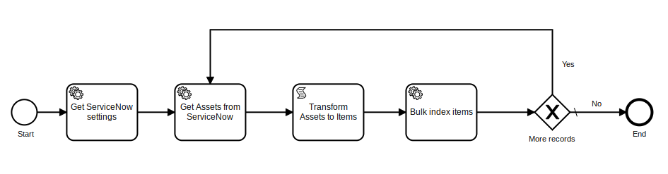

[](https://www.repostatus.org/#wip)

# Onify Blueprint: Indexing Assets from ServiceNow

In this Blueprint we show how easy it is to connect to ServiceNow API and read information, in this case assets. Then we index the assets from ServiceNow to Onify using our bulk index endpoint. This is how easy we can integrate with a REST-API. We can also index anything from ServiceNow like tickets, services, CI's etc. It is just a matter of changing the endpoint for ServiceNow API :)



## Requirements

* Onify Hub v2
* Onify Flow license
* Camunda Modeler 4.4 or later 
* Curl command (maybe)
* ServiceNow (dah :-)

## Included

* 3 x Settings
* 2 x Resources
* 1 x Flows

## Setup

### Settings

* Replace `<ONIFY-HUB-API-URL>` with Onify Hub API url
* Replace `<AUTH-TOKEN>` with Onify Hub API auth token
* Replace `<SERVICENOW-INSTANCE>` with ServiceNow instance url
* Replace `<SERVICENOW-USERNAME>` with ServiceNow instance username
* Replace `<SERVICENOW-PASSWORD>` with ServiceNow instance password

#### Add setting for ServiceNow instance

```bash
curl -X POST "<ONIFY-HUB-API-URL>/api/v2/admin/config/settings?refresh=false" -H "accept: application/json" -H "authorization: <AUTH-TOKEN>" -H "Content-Type: application/json" -d "{ \"key\": \"_servicenow_url\", \"name\": \"ServiceNow URL\", \"value\": \"<SERVICENOW-INSTANCE>/api/now\", \"type\": \"string\", \"tag\": [ \"servicenow\" ], \"category\": \"custom\" }"
```

#### Add setting for ServiceNow username

```bash
curl -X POST "<ONIFY-HUB-API-URL>/api/v2/admin/config/settings?refresh=false" -H "accept: application/json" -H "authorization: <AUTH-TOKEN>" -H "Content-Type: application/json" -d "{ \"key\": \"_servicenow_username\", \"name\": \"ServiceNow username\", \"value\": \"<SERVICENOW-USERNAME>\", \"type\": \"string\", \"tag\": [ \"servicenow\" ] }"
```

#### Add setting for ServiceNow password

```bash
curl -X POST "<ONIFY-HUB-API-URL>/api/v2/admin/config/settings?refresh=false" -H "accept: application/json" -H "authorization: <AUTH-TOKEN>" -H "Content-Type: application/json" -d " { \"key\": \"_servicenow_password\", \"name\": \"ServiceNow password\", \"value\": \"<SERVICENOW-PASSWORD>/api/now\", \"type\": \"password\", \"tag\": [ \"servicenow\" ], \"category\": \"custom\" }"
```

### Resources

1. Copy files to resources
2. Modifiy `transform_item.js` and make custom changes to item transformation (optional)

### Flows

#### Deploy

1. Open `index-assets-servicenow.bpmn` in Camunda Modeler
2. Customize the flow (optional)
3. Click `Deploy current diagram` and follow the steps

#### Run 

To test and run the flow, click `Start current diagram`

## Support

* Community/forum: https://support.onify.co/discuss
* Documentation: https://support.onify.co/docs
* Support and SLA: https://support.onify.co/docs/get-support

## License

This project is licensed under the MIT License - see the [LICENSE](LICENSE) file for details.
